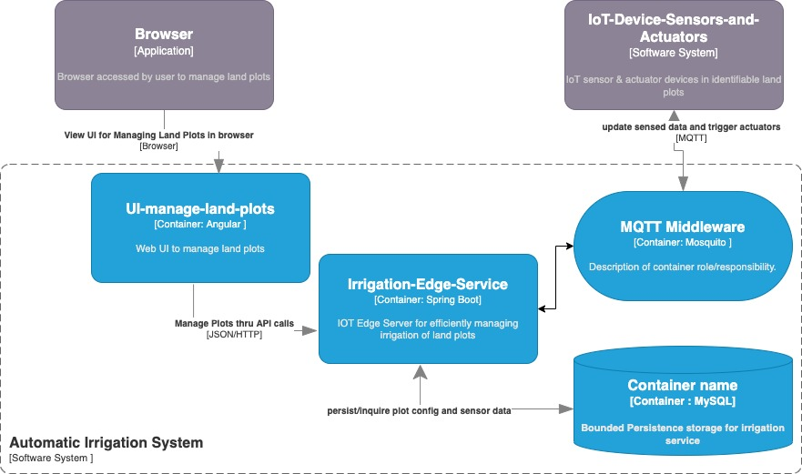
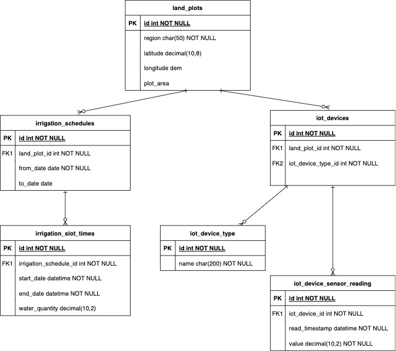
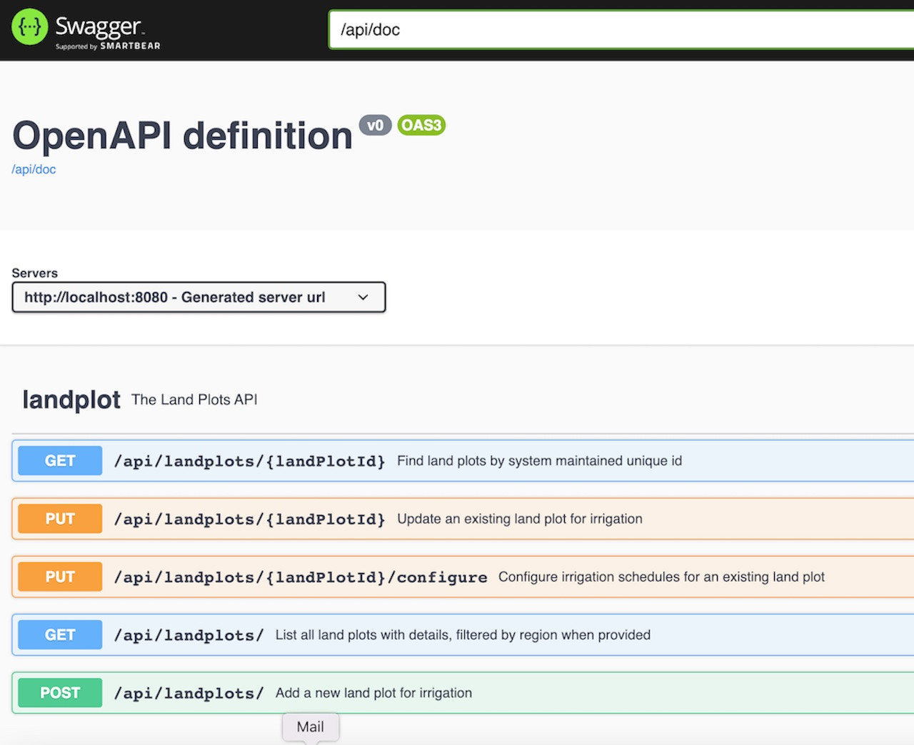

# AIS
Automatic Irrigation System for efficient watering cultivation lands

Demonstrates a solution to efficiently manage the irrigation of cultivation lands, use an api to configure land plots and their irrigation schedules, and additionally overrides the configuration via sensing the soil moisture and water levels.

The system comprises of below containers/components :
* The edge service - that will have the core implementation of the above solution, designed following a best practice from 'clean-architecture',  which interacts with external via gateways for Database (MySQL) and MQTT Middleware (Eclipse Mosquitto) , also expose a Rest API to manage the land plot resource and configure its irrigation schedules.

> Containing services/modules :
> 1.  Entity - Implements the core business rules  
> 2.  UseCases - Services that implements user stories, also contains models/DTO that are transferred across boundaries    
>     - LandPlotService - abstract the main UseCase,  provide default implementation using LandPlotServiceDefault, and use Spring transaction management for database writes.    
> 3.  Interface Adaptors - Services expose or consume external services/applications      
>     - LandPlotRestApi - expose rest api to update/configure land plots   
>     - LandPlotRepo - Spring Data Integration with JPA/Hibernate, CRUD functionality against the data source using Spring Repository pattern
>     - LandPlotApiExceptionHandler - Cross-cutting concerns like transactions and exceptions are handled using inbuilt Spring AOP  
  
  

* The Web application - will provide the UI to maintain the land plots and consume the Rest API provided by the edge service

* MySQL database - for persisting the land plot configurations and collected soil sensor data  
>  The 

* Eclipse Mosquitto (implements MQTT protocol) - event-driven, light weight messaging between the edge service and the IoT devices  

### The High level architecture diagram

### ERD diagram of irrigation system  

 

## Pre-requesites :
*  Java  1.8+
*  MySQL 8
*  Maven 3.2+
*  Eclipse Mosquitto 2.15 (optional) 
		

## Setup a runtime env. for the application:

** Clone this repository and build the application using :**  
>  -  mvn clean package   
   *(Note: the built artifact 'automatic-irrigation-system'.jar, will be found in location ./target/ ) *  
   
** Execute the following SQL script in MySQL to create the required DB schema and user  :**   
>  -   [Create Database](./scripts/db_mysql.sql)    
	*(Note: change user/password as required, and if changed, consider updating the following application launch command too)*
	***Flyway migration tool is integrated for database schema ddl and dml migration, and version control. ***

** Start the application with below command :   **  
>  -  java -jar ./target/automatic-irrigation-system.jar --server.port=8080 --mysql.host=localhost --mysql.port=3306 --mysql.database=ais --mysql.username=aisapp --mysql.password=123    
   *(Note: the sensitive or environment specific configuration parameters are overridden with CLI options to above java command, ensure the database user/password given here is correct as per previous creation script )* 
   
** TODO: Optionally run within a docker container : **
>  -  docker build -t andela/ais .
>  -  docker run -p 8080:8080 andela/ais
	

## Access the API document
		
**APIs are "self-documented" by OpenApi/Swagger using annotations**   
>  - OpenAPI document is accessed ( or download yaml format) from :    
>  		-  http://localhost:8080/api/doc   
>  		-  http://localhost:8080/api/doc.yaml

>  - A more user friendly UI (Swagger) of OpenAPI document is accessed format from :  
>  		-  http://localhost:8080/api/swagger

>       	
   	

 
  
 
